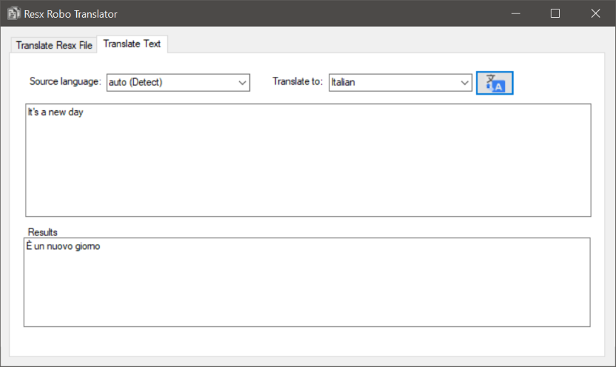
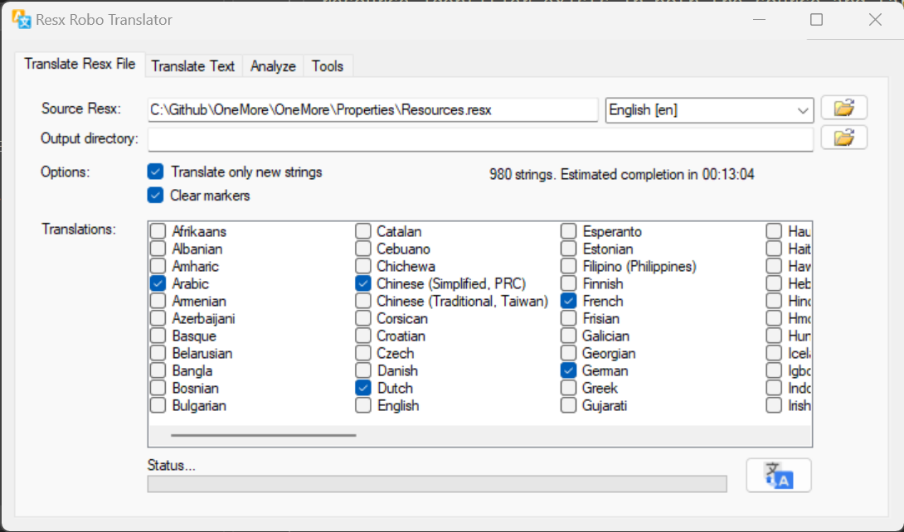
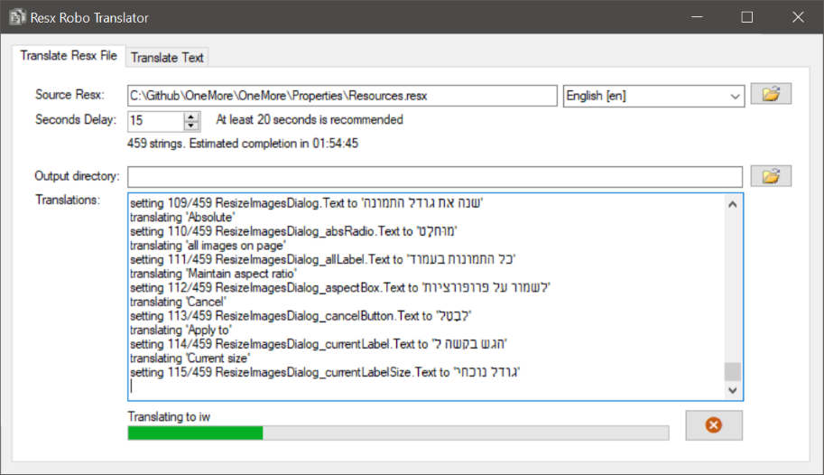

# ResxTranslator
Automates the translation of resx files using throttled access to the Google Translation API in an attempt to avoid the dreaded 403

Inspired by https://github.com/salarcode/AutoResxTranslator

### Translate Text
Translate one string, phrase, or paragraph of text.

### Translate Resx File
Translate an entire .resx file to one or more languages.

1. Choose a .resx file to translate. It will detect the language based on the language/culture
   code in the filename. 
2. Choose the output directory where new .resx files should be stored. If this is left blank
   then new files are stored in the same directory as the source file.
3. Adjust the number of seconds to wait between each string translation. A number too low
   (somewhere less than 15 seconds) may cause Google to temporarily block with a 403 or 429
   error. When that happens, the translator will pause for 5 seconds and retry. Then it will
   pause for 10 seconds, 20, 30, 40, 50, and finally every 60 seconds for an hour before
   giving up.

You can also translate only new strings added to your source resx file that are not yet
present in the target resx file(s) by ticking the _Translate only new strings_ checkbox.

#### Language Selections

#### Working

#### Skipping Resources

If the resource file includes control or configuration entries that should not be translated
then flag these by including the word **SKIP** in the entry's comment. It must be capitalized.
The comment can include other text besides the word SKIP.

#### Inflation Detection

The free Google translator will sometime add extra spaces around non-alphanumeric characters
when translating. For example "x+1" may become "x + 1" (from no spaces around the plus sign,
to spaces around the plus sign.) 

ResxTranslator attempts to detect this string *inflation* and displays a warning for each
string that may need manual tuning.
